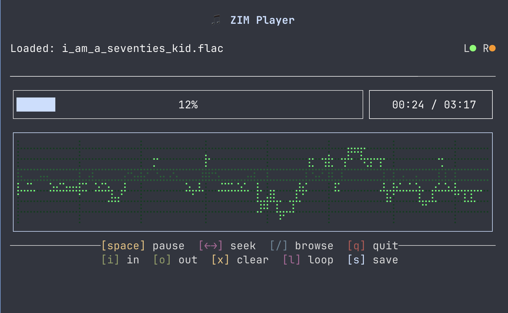
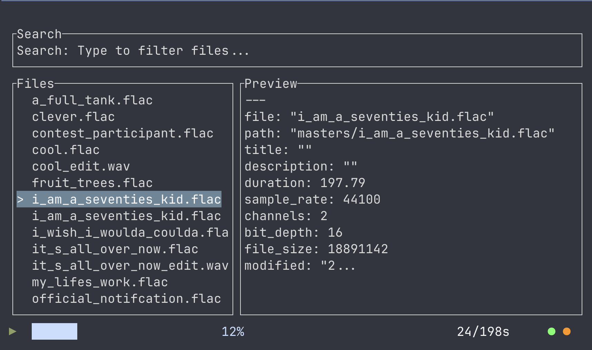

[](https://github.com/navicore/zim-studio/actions/workflows/dependabot/dependabot-updates)
[](https://github.com/navicore/zim-studio/actions/workflows/ci.yml)
[](https://github.com/navicore/zim-studio/actions/workflows/release.yml)

# ZIM Studio v1.0.0 - Terminal-Based Audio Studio Tools

*A [Zettelkasten](https://en.wikipedia.org/wiki/Zettelkasten) Information System for Music with Integrated Audio Player*

ZIM Studio provides three main functions:
  1. **Project Management**: Initialize a project structure of directories and placeholder README.md files
  2. **Metadata System**: Generate searchable sidecar files for all audio media with YAML frontmatter
  3. **Audio Player**: Professional sample browsing, auditioning, and editing with TUI interface

## ✨ New in v1.0.0

- **AIFF Support**: Full support for AIFF audio files with proper sample rate parsing
- **Enhanced Navigation**: Shift+Arrow keys for 20% jumps through long recordings
- **Smart Sidecar Cloning**: When saving selections, automatically clones source metadata with:
  - Updated duration for the extracted selection
  - ISO 8601 timestamps for extraction time
  - Provenance tracking (source file, time ranges)
  - Graceful handling of missing source sidecars

The sidecar format is YAML embedded in markdown, providing both structured metadata 
and free-form notes. The YAML contains facts about the track while the markdown 
enables long-form notes, links to inspiration, TODO checklists, etc.

See [example sidecar file](examples/sidecar-example.md) for a complete example.

The motivation for creating `zim` is twofold:

  1. Maintain a workflow where DAWs are guests in my workflow rather than the
     other way around.
  2. I use [neovim](https://neovim.io/) and
     [telescope](https://github.com/nvim-telescope/telescope.nvim) for my
     personal note taking and rely on no proprietary company to enable my
     ability to work in software ... I wanted the same detailed note taking
     independent of any vendor for my music making.  I use DAWs but am not ok
     living in DAWs or any vendor's closed system.

## Installation

```bash
# Install with just the project management and metadata features
cargo install zim-studio

# Install with the audio player feature included
cargo install zim-studio --features player
```

## Quick Start

```bash
# Initialize ZIM with your music projects directory
zim init ~/Music/Projects

# Create a new project
zim new "My Greatest Hits"
# Creates: ~/Music/Projects/my_greatest_hits/

# Navigate to your project and add some audio files
cd ~/Music/Projects/my_greatest_hits
cp ~/Desktop/track1.flac masters/
cp ~/Desktop/track2.wav masters/

# Generate sidecar metadata files
zim update .
# Creates: masters/track1.flac.md, masters/track2.wav.md

# Edit the generated sidecar files to add your notes
$EDITOR masters/track1.flac.md

# Validate all YAML frontmatter
zim lint .

# View/edit global configuration
zim config view
zim config edit
```

## Project Structure

When you create a new project with `zim new`, it generates:

```
my_greatest_hits/
├── .gitignore          # Ignores audio/video files
├── README.md           # Project overview
├── masters/            # Final mastered tracks
├── mixes/              # Mix versions
├── sources/            # Raw recordings, samples
├── edits/              # Edited/comped audio
├── bounced/            # Bounced/rendered audio (stems, etc)
└── project/            # DAW project files
    ├── live/           # Ableton Live
    ├── reaper/         # Reaper
    ├── bitwig/         # Bitwig Studio
    └── renoise/        # Renoise
```

## Sidecar Files

`zim update` generates a `.md` sidecar for each audio file with:
- **YAML frontmatter**: Structured metadata (technical specs, tags, etc.)
- **Markdown body**: Free-form notes, ideas, TODO lists

The YAML is designed to be both human-editable and scriptable for automation.
See the [example sidecar](examples/sidecar-example.md) for what this looks like in practice.

## Shell Completions

Add to your shell configuration:

```bash
# Bash (~/.bashrc)
source <(zim completions bash)

# Zsh (~/.zshrc)
source <(zim completions zsh)

# Fish (~/.config/fish/config.fish)
zim completions fish | source

# PowerShell ($PROFILE)
zim completions powershell | Out-String | Invoke-Expression
```

## Development

```bash
# Run all checks locally (matches CI)
make ci

# Individual commands
make fmt        # Format code
make clippy     # Run lints
make test       # Run tests
make check      # Check compilation
```

## Audio Player User Guide

The optional audio player provides a fast, keyboard-driven interface for browsing, auditioning, and editing audio samples directly from the terminal.

### Launching the Player

```bash
# Launch with no file (opens browser)
zim player

# Launch with a specific audio file
zim player path/to/audio.wav
```

### Main Interface



The player interface consists of:
- **Title Bar**: Shows "🎵 ZIM Player"
- **File Info & LEDs**: Current file name and stereo level indicators
- **Progress Bar**: Playback position with mark in/out indicators
- **Oscilloscope**: Real-time waveform visualization (when window is tall enough)
- **Control Hints**: Two rows of keyboard shortcuts

### Keyboard Controls

#### Playback Controls
- `[space]` - Play/Pause toggle
- `[←]` - Seek backward 5 seconds  
- `[→]` - Seek forward 5 seconds
- `[Shift+←]` - Jump backward 20% (great for long recordings)
- `[Shift+→]` - Jump forward 20% (great for long recordings)

#### Mark & Loop Controls
- `[i]` - Set mark in at current position
- `[o]` - Set mark out at current position
- `[x]` - Clear all marks
- `[l]` - Toggle loop playback of marked selection

#### File Operations
- `[/]` - Open file browser
- `[s]` - Save/export (full file or marked selection)
- `[q]` - Quit player

### File Browser



The built-in file browser searches through your audio files using their sidecar `.md` metadata:

1. Press `/` to open the browser
2. Start typing to search - it searches within the markdown content of sidecar files
3. Use `[↑/↓]` to navigate results
4. Press `[Enter]` to load the selected file
5. Press `[Esc]` to close browser

**Note**: The browser displays audio files but searches their `.md` sidecar content. For example, if you have `kick.wav` with `kick.wav.md` containing "punchy 808 style", searching for "808" will find this file.

### Mark In/Out & Looping


The mark feature lets you select a portion of the audio:

1. Play the file and press `[i]` at the desired start point
2. Press `[o]` at the desired end point
3. The selection appears highlighted on the progress bar
4. Press `[l]` to loop the selection continuously
5. The time display shows selection duration in brackets: `[3.5s]`

### Save Dialog


When saving (`[s]`), the save dialog provides:

- **Directory Browser**: Navigate folders with `[↑/↓]` and `[Enter]`
- **Filename Field**: Editable with smart naming for edits
- **Tab Navigation**: Use `[Tab]` to switch between directory list and filename
- **Smart Extensions**: 
  - Selections always save as `.wav` (even from FLAC sources)
  - Full file saves preserve original format

Example auto-generated filenames:
- First edit: `original_edit.wav`
- Subsequent edits: `original_edit_2.wav`, `original_edit_3.wav`, etc.

### LED Level Indicators

[IMAGE: Close-up of LED indicators showing different levels]

The stereo LED indicators show real-time audio levels:
- **L (Left)**: Green LEDs - dim → medium → bright → red (clipping)
- **R (Right)**: Orange LEDs - dim → medium → bright → red (clipping)
- **Symbols**: ○ (off/quiet) → ◐ (medium) → ● (loud)

### Supported Formats

- **WAV**: 8, 16, 24, and 32-bit
- **FLAC**: All bit depths (converted to 16-bit WAV when saving selections)  
- **AIFF**: All bit depths with intelligent sample rate detection

### Tips & Workflow

1. **Quick Sample Chopping**: Load file → mark in/out → save = done
2. **Preview Before Save**: Use `[l]` to loop your selection before saving
3. **Rapid Browsing**: The browser remembers your search, making it fast to audition similar samples
4. **Long Recording Navigation**: Use Shift+Arrow for 20% jumps to quickly navigate through long recordings
5. **Metadata Preservation**: When saving selections, source metadata is automatically cloned with updated duration and provenance tracking
6. **No Mouse Needed**: Everything is keyboard-driven for speed

### Troubleshooting

- **No Audio**: Check system audio output settings
- **Browser Not Finding Files**: Ensure `.md` sidecar files exist (run `zim update`)
- **Visual Glitches**: Resize terminal window or restart player

## License

MIT
